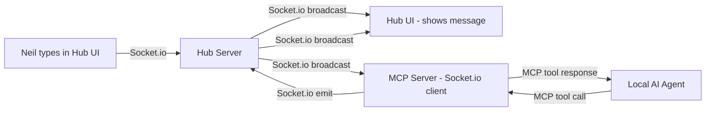

# Agent Chat Bridge — Real-Time Chat for Local AI Agents

## Problem

A local AI agent (e.g., Claude Code, Roo) running behind a firewall needs to:
1. **Read new messages** from the Hub's chat window in real-time
2. **Send responses** that appear in the Hub's chat window (not just the activity feed)

### Current Gaps

| Gap | Details |
|-----|---------|
| **No `POST /api/messages`** | Chat messages can only be sent via Socket.io (`socket.emit('message')`). There's no REST endpoint for creating messages. |
| **MCP `send_message` creates activities, not chat messages** | The MCP server's `send_message` tool posts to `/api/service/activities`, so messages appear in the activity feed but NOT in the chat window. |
| **No real-time message subscription** | The MCP server's `get_messages` does a one-shot HTTP fetch. There's no way for an agent to subscribe to new messages as they arrive. |

## Solution: Socket.io Chat Bridge via MCP

The simplest approach is a **Socket.io client** that connects outbound from the local machine to the Hub. Since Socket.io connections are initiated by the client, they work fine behind firewalls and NAT.

We'll add two new MCP tools that use Socket.io under the hood:

### Architecture



### How It Works

1. **On MCP server startup**, a persistent Socket.io client connects to the Hub using the auth token
2. **Incoming messages** from the Hub are buffered in a small in-memory queue
3. **New MCP tool `chat_listen`** returns buffered messages since last call (drains the queue)
4. **Updated MCP tool `send_message`** sends via Socket.io `emit('message')` instead of the activity API, so messages appear in the actual chat window
5. The agent calls `chat_listen` in a loop to check for new messages, processes them, and responds via `send_message`

## Implementation Plan

### 1. Add Socket.io client to MCP server

**File:** `server/mcp-server.ts`

- Import `socket.io-client`
- On startup, connect to `BASE_URL` with auth token
- Listen for `'message'` events and buffer them in an array (capped at 100)
- Handle reconnection gracefully

### 2. Add `chat_listen` MCP tool

**File:** `server/mcp-server.ts`

New tool that:
- Returns all buffered messages since last call
- Clears the buffer after returning
- Returns empty array if no new messages
- Includes a `since` parameter (optional ISO timestamp) to filter

### 3. Fix `send_message` MCP tool to use Socket.io

**File:** `server/mcp-server.ts`

Change `send_message` to:
- Emit via the Socket.io connection: `socket.emit('message', { sender: 'Swissclaw', content })`
- This inserts into the `messages` table AND broadcasts to all clients (including the Hub UI)
- Falls back to the activity API if Socket.io is disconnected

### 4. Add `POST /api/service/messages` REST endpoint (optional fallback)

**File:** `server/index.ts`

Add a service-token-authenticated endpoint that:
- Inserts into `messages` table
- Broadcasts via `io.emit('message', ...)`
- Provides a REST fallback if Socket.io isn't available

### 5. Update MCP server dependencies

**File:** `package.json`

- Add `socket.io-client` as a dependency (it may already be in client deps but needs to be in server deps too)

### 6. Add tests

- Unit test for message buffering logic
- Integration test for `POST /api/service/messages` endpoint
- Test that `send_message` via Socket.io creates a proper chat message

## Detailed Design

### Message Buffer (in MCP server)

```
interface BufferedMessage {
  id: number;
  sender: string;
  content: string;
  created_at: string;
  received_at: string;  // when MCP server received it
}

- Max buffer size: 100 messages
- FIFO: oldest messages dropped when buffer is full
- Cleared on each chat_listen call
```

### New MCP Tools

| Tool | Parameters | Returns |
|------|-----------|---------|
| `chat_listen` | `since?` (ISO timestamp) | Array of new messages since last call |
| `send_message` (updated) | `content` (string) | The created message object |

### Auth Flow

The Socket.io client in the MCP server authenticates using `SWISSCLAW_AUTH_TOKEN`:

```
Socket.io handshake: { auth: { token: SWISSCLAW_AUTH_TOKEN } }
```

This is the same mechanism the Hub UI uses. The token must be a valid session token.

### Typical Agent Loop

```
1. Agent calls chat_listen -> gets new messages (or empty array)
2. If messages found, agent processes them and decides on response
3. Agent calls send_message with response content
4. Repeat from step 1
```

## Files to Modify

| File | Change |
|------|--------|
| `server/mcp-server.ts` | Add Socket.io client, `chat_listen` tool, fix `send_message` |
| `server/index.ts` | Add `POST /api/service/messages` endpoint |
| `package.json` | Add `socket.io-client` dependency |
| `docs/mcp-server.md` | Document new tools and chat bridge usage |
| `tests/integration/messages.test.js` | Add test for service messages endpoint |

## Security Considerations

- Socket.io connection uses existing auth token mechanism
- Service messages endpoint uses existing `X-Service-Token` auth
- Message rate limiting already exists on Socket.io (30/min)
- Input validation and sanitization already in place
- No new attack surface — reuses existing auth and validation
