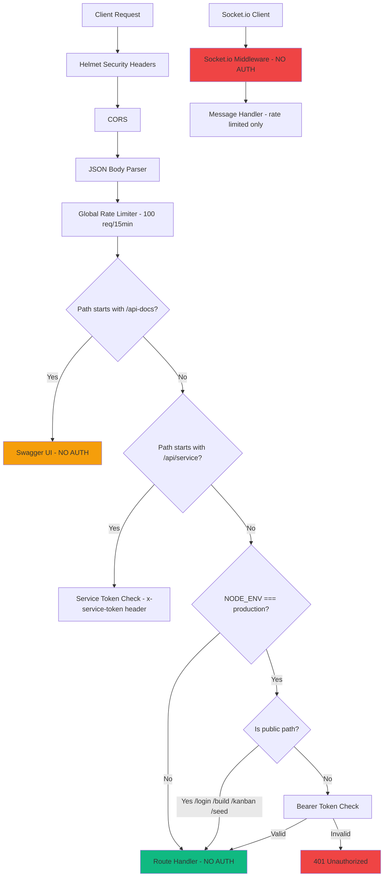

# API Security Audit

**Date:** 2026-02-16  
**Scope:** All HTTP and WebSocket endpoints in `server/index.ts`

---

## Summary

The application has **significant security gaps**. Auth is only enforced in production, several endpoints are explicitly public that shouldn't be, well-built security middleware exists but is **not wired up**, and the enhanced auth router is **never mounted**.

---

## Endpoint Inventory

### Authentication Behaviour

Auth middleware (`requireAuth`) is applied at line 476–479 of `server/index.ts`:

```ts
if (process.env.NODE_ENV === 'production') {
  app.use('/api', requireAuth);
}
```

**Critical issue #1:** Auth is **only applied in production**. In development/test, every endpoint is wide open.

The `requireAuth` middleware (line 106–124) exempts these paths:

```ts
const publicApiPaths = ['/login', '/build', '/kanban', '/seed'];
const publicRootPaths = ['/health', '/login'];
```

### Endpoint-by-Endpoint Analysis

| Endpoint | Method | Auth Required? | Issue |
|---|---|---|---|
| `/health` | GET | ❌ No (public) | ✅ Correct — health checks should be public |
| `/login` | GET | ❌ No (public) | ✅ Correct — serves login page |
| `/api/login` | POST | ❌ No (public) | ✅ Correct — login endpoint |
| `/api/build` | GET | ❌ No (public) | ⚠️ Low risk — exposes commit hash, but generally acceptable |
| `/api/kanban` | GET | ❌ No (public) | 🔴 **VULNERABLE** — full board data exposed without auth |
| `/api/seed` | POST | ❌ No (public) | 🔴 **VULNERABLE** — anyone can trigger database seeding |
| `/api/status` | GET | ✅ Yes (prod only) | ⚠️ Only in production |
| `/api/messages` | GET | ✅ Yes (prod only) | ⚠️ Only in production |
| `/api/kanban/tasks` | POST | ✅ Yes (prod only) | ⚠️ Only in production |
| `/api/kanban/tasks/:id` | PUT | ✅ Yes (prod only) | ⚠️ Only in production |
| `/api/kanban/tasks/:id` | DELETE | ✅ Yes (prod only) | ⚠️ Only in production |
| `/api/kanban/reorder` | POST | ✅ Yes (prod only) | ⚠️ Only in production |
| `/api/activities` | POST | ✅ Yes (prod only) | ⚠️ Only in production |
| `/api/activities` | GET | ✅ Yes (prod only) | ⚠️ Only in production |
| `/api/service/activities` | POST | ✅ Own auth (service token) | ✅ Correct — uses `x-service-token` header |
| `/api/service/model-usage` | POST | ✅ Own auth (service token) | ✅ Correct — uses `x-service-token` header |
| `/api-docs` | GET | ❌ No | ⚠️ Swagger UI publicly accessible — should be restricted in prod |
| `/api-docs.json` | GET | ❌ No | ⚠️ OpenAPI spec publicly accessible |
| Socket.io | WS | ❌ No | 🔴 **VULNERABLE** — TODO comment at line 1201 says "Implement proper JWT verification" |

---

## Critical Findings

### 🔴 Finding 1: `/api/kanban` is explicitly public

**File:** [`server/index.ts`](server/index.ts:109)  
**Line 109:** `/kanban` is in the `publicApiPaths` array, meaning the full kanban board (all columns and tasks) is readable by anyone without authentication, even in production.

**Risk:** Information disclosure — all task titles, descriptions, priorities, and assignments are exposed.

### 🔴 Finding 2: `/api/seed` is explicitly public

**File:** [`server/index.ts`](server/index.ts:109)  
**Line 109:** `/seed` is in the `publicApiPaths` array. While the endpoint is idempotent (won't re-seed if tasks exist), it still allows unauthenticated users to trigger database writes in production.

**Risk:** Unauthorized data modification.

### 🔴 Finding 3: Socket.io has no authentication

**File:** [`server/index.ts`](server/index.ts:1199-1206)  
The Socket.io `io.use()` middleware has a TODO comment but performs no actual verification. Any client can connect and send chat messages that get persisted to the database.

**Risk:** Unauthorized message injection, potential spam/abuse.

### ⚠️ Finding 4: Auth only enforced in production

**File:** [`server/index.ts`](server/index.ts:476-479)  
The `requireAuth` middleware is wrapped in `if (process.env.NODE_ENV === 'production')`. This means all endpoints are completely unprotected in development and test environments.

**Risk:** If a non-production instance is accidentally exposed, all data is accessible.

### ⚠️ Finding 5: Enhanced auth system is dead code

**Files:** [`server/middleware/auth.ts`](server/middleware/auth.ts), [`server/routes/auth.ts`](server/routes/auth.ts), [`server/middleware/security.ts`](server/middleware/security.ts)

A comprehensive auth system exists with:
- Database-backed sessions (`SessionStore`)
- bcrypt password hashing
- CSRF protection
- Per-user rate limiting
- SQL injection detection
- XSS protection middleware
- Security audit logging

**None of this is imported or used in `server/index.ts`.** The main server uses a simple in-memory `Set<string>` for sessions and `Math.random()` for token generation.

### ⚠️ Finding 6: Weak token generation

**File:** [`server/index.ts`](server/index.ts:339)  
```ts
const token = Math.random().toString(36).substring(2);
```
`Math.random()` is not cryptographically secure. The enhanced auth module at [`server/middleware/auth.ts`](server/middleware/auth.ts:9) correctly uses `crypto.randomBytes(32)` but is unused.

### ⚠️ Finding 7: In-memory session store

**File:** [`server/index.ts`](server/index.ts:103)  
Sessions are stored in `const sessions = new Set<string>()`. All sessions are lost on server restart, and there's no expiration mechanism. The database-backed `SessionStore` in [`server/middleware/auth.ts`](server/middleware/auth.ts:13) solves this but is unused.

---

## Architecture Diagram



---

## Remediation Plan

### Step 1 — Enforce auth in ALL environments (not just production)

**File:** [`server/index.ts`](server/index.ts:476-479)

Remove the `if (process.env.NODE_ENV === 'production')` guard around `requireAuth`. Auth will apply in dev, test, and production.

```ts
// BEFORE:
if (process.env.NODE_ENV === 'production') {
  app.use('/api', requireAuth);
}

// AFTER:
app.use('/api', requireAuth);
```

### Step 2 — Remove `/kanban` and `/seed` from public paths

**File:** [`server/index.ts`](server/index.ts:109)

Only `/login` and `/build` should be public API paths. `/health` remains public as a root path.

```ts
// BEFORE:
const publicApiPaths = ['/login', '/build', '/kanban', '/seed'];

// AFTER:
const publicApiPaths = ['/login', '/build'];
```

### Step 3 — Secure Socket.io with token verification

**File:** [`server/index.ts`](server/index.ts:1199-1206)

Verify the auth token during the Socket.io handshake:

```ts
io.use((socket, next) => {
  const token = socket.handshake.auth?.token || socket.handshake.query?.token;
  if (!token || !sessions.has(token)) {
    return next(new Error('Authentication required'));
  }
  next();
});
```

### Step 4 — Replace `Math.random()` with `crypto.randomBytes()`

**File:** [`server/index.ts`](server/index.ts:339)

```ts
// BEFORE:
const token = Math.random().toString(36).substring(2);

// AFTER:
import crypto from 'crypto';
const token = crypto.randomBytes(32).toString('hex');
```

### Step 5 — Create a test helper for authenticated requests

**New file:** `tests/helpers/auth.js`

Create a shared helper that logs in and returns a token, so all integration tests can easily get an auth token:

```js
const request = require('supertest');
const { app } = require('../../server/index');

async function getAuthToken() {
  const res = await request(app)
    .post('/api/login')
    .send({
      username: process.env.AUTH_USERNAME || 'admin',
      password: process.env.AUTH_PASSWORD || 'changeme123',
    });
  return res.body.token;
}

module.exports = { getAuthToken };
```

### Step 6 — Update ALL integration tests to use auth tokens

Every test that hits a protected endpoint needs to include `.set('Authorization', 'Bearer <token>')`. The affected test files and their changes:

| Test File | Endpoints Tested | Change Required |
|---|---|---|
| [`tests/integration/kanban-simple.test.js`](tests/integration/kanban-simple.test.js) | GET/POST/PUT/DELETE kanban | Add auth token to all requests |
| [`tests/integration/kanban.test.js`](tests/integration/kanban.test.js) | POST/PUT/GET kanban | Add auth token to all requests |
| [`tests/integration/kanban-edge-cases.test.js`](tests/integration/kanban-edge-cases.test.js) | Kanban edge cases | Add auth token to all requests |
| [`tests/integration/kanban-ordering.test.js`](tests/integration/kanban-ordering.test.js) | Kanban reorder | Add auth token to all requests |
| [`tests/integration/messages.test.js`](tests/integration/messages.test.js) | GET /api/messages | Add auth token |
| [`tests/integration/status.test.js`](tests/integration/status.test.js) | GET /api/status | Add auth token |
| [`tests/integration/activities.test.js`](tests/integration/activities.test.js) | POST/GET /api/activities | Add auth token |
| [`tests/integration/auth-edge-cases.test.js`](tests/integration/auth-edge-cases.test.js) | Auth middleware tests | **Rewrite** — tests currently assert no-auth access works; flip to assert 401 without auth |

Pattern for each test file:

```js
const { getAuthToken } = require('../helpers/auth');

describe('...', () => {
  let authToken;

  beforeAll(async () => {
    await resetTestDb();
    authToken = await getAuthToken();
  });

  it('...', async () => {
    await request(app)
      .get('/api/some-endpoint')
      .set('Authorization', `Bearer ${authToken}`)  // ADD THIS
      .expect(200);
  });
});
```

### Step 7 — Add NEW tests that verify auth enforcement

**New file:** `tests/integration/auth-enforcement.test.js`

These tests prove that unauthenticated requests are rejected:

```js
describe('Auth enforcement', () => {
  // Protected endpoints should return 401 without a token
  it('GET /api/status returns 401 without auth', ...);
  it('GET /api/messages returns 401 without auth', ...);
  it('GET /api/kanban returns 401 without auth', ...);
  it('POST /api/kanban/tasks returns 401 without auth', ...);
  it('PUT /api/kanban/tasks/:id returns 401 without auth', ...);
  it('DELETE /api/kanban/tasks/:id returns 401 without auth', ...);
  it('POST /api/kanban/reorder returns 401 without auth', ...);
  it('POST /api/activities returns 401 without auth', ...);
  it('GET /api/activities returns 401 without auth', ...);
  it('POST /api/seed returns 401 without auth', ...);

  // Public endpoints should still work without auth
  it('GET /health returns 200 without auth', ...);
  it('POST /api/login returns 200 without auth', ...);
  it('GET /api/build returns 200 without auth', ...);

  // Invalid tokens should be rejected
  it('GET /api/status returns 401 with invalid token', ...);
  it('GET /api/status returns 200 with valid token', ...);
});
```

### Step 8 — Restrict Swagger UI in production

**File:** [`server/index.ts`](server/index.ts:291-296)

Gate Swagger behind auth in production:

```ts
if (process.env.NODE_ENV !== 'production') {
  app.use('/api-docs', swaggerUi.serve, swaggerUi.setup(swaggerSpec));
  app.get('/api-docs.json', (_req, res) => res.json(swaggerSpec));
}
```

---

## Impact Summary

```mermaid
flowchart LR
    subgraph Before
        A1[All endpoints open in dev/test]
        A2[/api/kanban public in prod]
        A3[/api/seed public in prod]
        A4[Socket.io unauthenticated]
        A5[Math.random tokens]
    end

    subgraph After
        B1[Auth enforced in ALL environments]
        B2[/api/kanban requires auth]
        B3[/api/seed requires auth]
        B4[Socket.io requires token]
        B5[crypto.randomBytes tokens]
    end

    A1 -->|Step 1| B1
    A2 -->|Step 2| B2
    A3 -->|Step 2| B3
    A4 -->|Step 3| B4
    A5 -->|Step 4| B5
```

## Files Modified

| File | Type of Change |
|---|---|
| `server/index.ts` | Remove production-only auth guard, fix public paths, secure Socket.io, fix token generation, gate Swagger |
| `tests/helpers/auth.js` | **New** — shared auth helper |
| `tests/integration/auth-enforcement.test.js` | **New** — tests proving auth is enforced |
| `tests/integration/kanban-simple.test.js` | Add auth tokens to all requests |
| `tests/integration/kanban.test.js` | Add auth tokens to all requests |
| `tests/integration/kanban-edge-cases.test.js` | Add auth tokens to all requests |
| `tests/integration/kanban-ordering.test.js` | Add auth tokens to all requests |
| `tests/integration/messages.test.js` | Add auth tokens to all requests |
| `tests/integration/status.test.js` | Add auth tokens to all requests |
| `tests/integration/activities.test.js` | Add auth tokens to all requests |
| `tests/integration/auth-edge-cases.test.js` | Rewrite to verify 401 responses |
