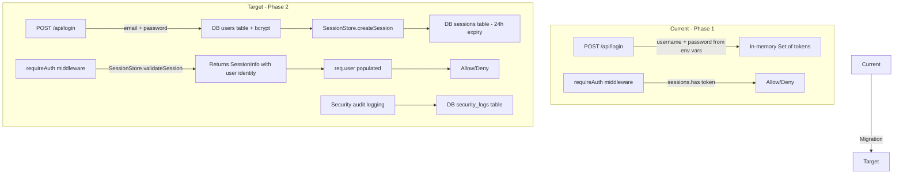
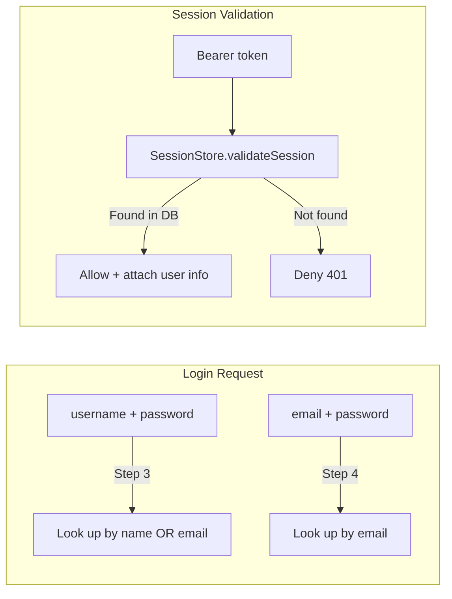

# Phase 2: Enhanced Auth Middleware Implementation

**Prerequisite:** Phase 1 completed — all endpoints secured with simple auth, 149 tests passing.

---

## Architecture Overview



---

## Implementation Steps

### Step 1 — Unify the database pool

**Problem:** Two separate `Pool` instances exist:
- `server/index.ts` line 256 creates its own pool
- `server/config/database.ts` line 39 creates another pool

**Solution:** Import the pool from `server/config/database.ts` into `server/index.ts` instead of creating a new one. This ensures the auth router and the main server share the same connection pool.

**Files:** `server/index.ts`

**Changes:**
- Remove the inline `Pool` creation and `getConnectionString()` function
- Import `{ pool }` from `./config/database`
- The config/database.ts pool already handles test env vars, but uses `TEST_DB_PORT=5432` while the test command uses `5433`. Need to verify and align.

### Step 2 — Replace the inline `requireAuth` with database-backed session validation

**Problem:** Current `requireAuth` uses `sessions.has(token)` with an in-memory Set.

**Solution:** Replace with `SessionStore.validateSession(token)` which:
- Checks the DB sessions table
- Verifies token hasn't expired (24h)
- Verifies token hasn't been revoked
- Returns user info (userId, email, name, role)
- Updates `last_accessed_at`

**Files:** `server/index.ts`

**Changes:**
- Import `SessionStore` from `./middleware/auth`
- Create a `sessionStore` instance using the shared pool
- Replace `requireAuth` to use `sessionStore.validateSession()`
- Attach user info to `req` (using `AuthenticatedRequest` type)
- Keep the in-memory `sessions` Set as a **fallback/cache** for the simple login during transition, or remove it entirely

### Step 3 — Replace the inline `/api/login` with database-backed authentication

**Problem:** Current login compares against `AUTH_USERNAME`/`AUTH_PASSWORD` env vars and generates tokens with `randomBytes`.

**Solution:** Replace with bcrypt-based authentication against the `users` table:
- Look up user by email (or username for backward compatibility)
- Compare password with bcrypt hash
- Create a DB session via `SessionStore.createSession()`
- Log the auth event to `security_logs`

**Files:** `server/index.ts`

**Backward compatibility:** Keep supporting `username` field in the login request body by looking up users by name OR email. This ensures existing tests and the login page continue to work.

### Step 4 — Mount the auth router

**Problem:** The enhanced auth router at `server/routes/auth.ts` is never imported or mounted.

**Solution:** Mount it at `/auth`:
```ts
import authRouter from './routes/auth';
app.use('/auth', authRouter);
```

This adds these endpoints:
- `POST /auth/login` — email-based login with bcrypt
- `POST /auth/logout` — revoke session
- `GET /auth/validate` — check if session is valid
- `GET /auth/me` — get current user profile
- `POST /auth/change-password` — change password with bcrypt

**Note:** The auth router currently imports `pool` from `server/config/database`. After Step 1 unifies the pool, this will work correctly.

### Step 5 — Apply security middleware

**Problem:** The security middleware in `server/middleware/security.ts` is not used.

**Solution:** Apply selectively:
- `authRateLimit` — already used by the auth router for `/auth/login`
- `sanitizeQuery` — apply to all API routes for SQL injection detection
- `xssProtection` — apply to all API routes for XSS prevention
- `securityErrorHandler` — add as error handler after routes

**Files:** `server/index.ts`

**Note:** Skip `auditLogger` for now — it intercepts `res.json()` which could have performance implications. Can be added later.

### Step 6 — Update Socket.io to use database sessions

**Problem:** Socket.io auth currently checks `sessions.has(token)` (in-memory).

**Solution:** Use `sessionStore.validateSession(token)` instead, so Socket.io connections are validated against the database.

**Files:** `server/index.ts`

### Step 7 — Seed a test admin user for backward compatibility

**Problem:** The test migration seeds users with emails (test@example.com, neil@example.com) but tests login with `username: 'admin'`. The `resetTestDb()` function truncates the users table.

**Solution:**
- Update `resetTestDb()` to re-seed test users after truncation
- Create an admin user with a known bcrypt password hash
- Update the login endpoint to support both `username` and `email` fields
- Update `tests/helpers/auth.js` to use the new login format

### Step 8 — Update all tests

**Files:** All test files in `tests/integration/` and `tests/api/`

**Changes:**
- Update `tests/helpers/auth.js` to login with email/password instead of username/password
- Update `resetTestDb()` to re-seed test users
- Add new tests for the `/auth/*` endpoints
- Add tests for session expiration and revocation
- Add tests for security middleware (sanitizeQuery, xssProtection)

### Step 9 — Add session cleanup

**Problem:** Expired and revoked sessions accumulate in the database.

**Solution:** Add a periodic cleanup that runs on server startup and every hour:
```ts
// Clean up expired sessions every hour
setInterval(() => sessionStore.cleanupExpiredSessions(), 60 * 60 * 1000);
```

**Files:** `server/index.ts`

---

## Migration Strategy

The key challenge is maintaining backward compatibility during the transition:



1. The `/api/login` endpoint will accept BOTH `username` and `email` fields
2. If `username` is provided, look up user by `name` column
3. If `email` is provided, look up user by `email` column
4. Compare password with bcrypt hash from `password_hash` column
5. Create a DB session and return the token
6. The `/auth/login` endpoint remains email-only (stricter)

---

## Test User Setup

The `resetTestDb()` function needs to seed an admin user:

```sql
INSERT INTO users (id, email, name, password_hash, role)
VALUES (
  'a0eebc99-9c0b-4ef8-bb6d-6bb9bd380a11',
  'admin@example.com',
  'admin',
  '$2b$10$...', -- bcrypt hash of 'changeme123'
  'admin'
)
```

This ensures `POST /api/login { username: 'admin', password: 'changeme123' }` continues to work.

---

## Files Modified Summary

| File | Change |
|---|---|
| `server/index.ts` | Unify pool, replace requireAuth, replace /api/login, mount auth router, apply security middleware, update Socket.io, add session cleanup |
| `server/config/database.ts` | Align test DB port with docker-compose (5433) |
| `server/routes/auth.ts` | Fix pool import after unification |
| `tests/helpers/auth.js` | Update login to use email/password |
| `tests/integration/auth-enforcement.test.js` | Add tests for /auth/* endpoints |
| All integration tests | Verify they still pass with DB sessions |

---

## What We Are NOT Doing (Future Work)

- **CSRF protection** — the `csrfProtection()` middleware exists but skips all `/api/` paths. Implementing it properly requires client-side changes.
- **Per-user rate limiting** — `createUserRateLimit()` exists but adds a DB query per request. Defer until needed.
- **Full audit logging** — `auditLogger()` intercepts every response. Defer for performance reasons.
- **Role-based access control** — user roles exist in the DB but no middleware enforces them yet.
