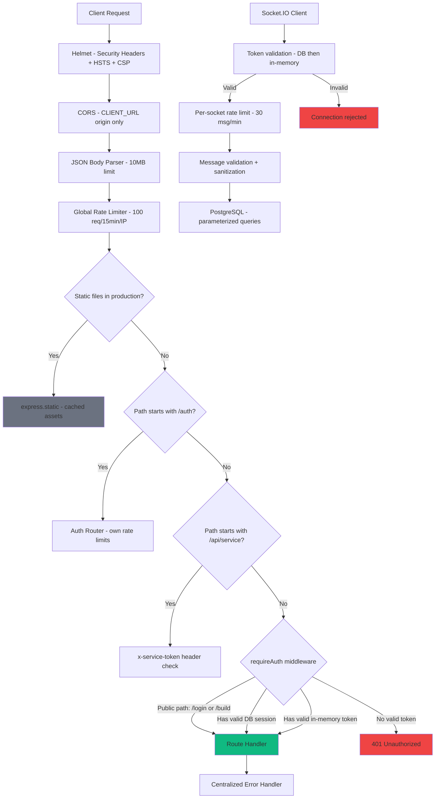

# Security Review: API Endpoints & Socket.IO

**Date:** 2026-02-16  
**Scope:** All HTTP endpoints, Socket.IO, middleware, and auth flow in `server/`  
**Previous audit:** [`plans/api-security-audit.md`](../plans/api-security-audit.md) — most critical findings have been remediated.

---

## Executive Summary

The application has made **significant security improvements** since the initial audit. Auth is now enforced in all environments, Socket.IO requires authentication, database-backed sessions replaced in-memory tokens, and `crypto.randomBytes` is used for token generation. However, several **medium-severity issues** remain, and some well-built security middleware is still not wired up.

### Scorecard

| Area | Rating | Notes |
|---|---|---|
| Authentication | ✅ Good | DB sessions, bcrypt, token auth enforced everywhere |
| Authorization | ⚠️ Fair | No role-based access control; any authenticated user can do anything |
| Input Validation | ⚠️ Fair | Basic sanitization exists but inconsistent; advanced middleware unused |
| Rate Limiting | ✅ Good | Global rate limit + Socket.IO per-connection + auth endpoint rate limit |
| Transport Security | ✅ Good | Helmet with HSTS, CSP configured |
| Socket.IO | ✅ Good | Auth required on handshake, per-socket rate limiting |
| Error Handling | ✅ Good | Centralized error handler, no stack traces leaked in production |
| Logging | ✅ Good | Structured logging with pino, security event logging available |

---

## What's Working Well ✅

### 1. Auth enforced in ALL environments

**File:** [`server/index.ts:531`](../server/index.ts:531)

```ts
app.use('/api', requireAuth);
```

No longer gated behind `NODE_ENV === 'production'`. This was the #1 critical finding from the previous audit and is now fixed.

### 2. Database-backed sessions with expiry

**File:** [`server/middleware/auth.ts:20-35`](../server/middleware/auth.ts:20)

Sessions are stored in PostgreSQL with 24-hour expiry, revocation support, and `last_accessed_at` tracking. The [`SessionStore`](../server/middleware/auth.ts:13) class is well-designed with:
- [`createSession()`](../server/middleware/auth.ts:20) — generates `crypto.randomBytes(32)` tokens
- [`validateSession()`](../server/middleware/auth.ts:37) — checks expiry AND revocation
- [`revokeSession()`](../server/middleware/auth.ts:72) — soft-delete via `revoked_at`
- [`revokeAllUserSessions()`](../server/middleware/auth.ts:85) — used on password change
- [`cleanupExpiredSessions()`](../server/middleware/auth.ts:98) — garbage collection

### 3. Socket.IO authentication

**File:** [`server/index.ts:1251-1277`](../server/index.ts:1251)

Socket.IO now requires a valid session token during the handshake. It checks database-backed sessions first, then falls back to in-memory sessions for backward compatibility. Unauthenticated connections are rejected with `Error: Authentication required`.

### 4. Socket.IO rate limiting

**File:** [`server/index.ts:1279-1332`](../server/index.ts:1279)

Per-socket rate limiting at 30 messages/minute with proper cleanup on disconnect. Message validation enforces max 5000 chars for content and 50 chars for sender.

### 5. Helmet security headers

**File:** [`server/index.ts:267-282`](../server/index.ts:267)

Properly configured with:
- Content Security Policy with restrictive directives
- HSTS with 1-year max-age, includeSubDomains, and preload
- All default Helmet protections enabled

### 6. Secure token generation

**File:** [`server/index.ts:353`](../server/index.ts:353) and [`server/middleware/auth.ts:8-10`](../server/middleware/auth.ts:8)

Both login paths use `crypto.randomBytes(32).toString('hex')` — 256 bits of cryptographic randomness. The previous `Math.random()` vulnerability is fixed.

### 7. Bcrypt password hashing

**File:** [`server/index.ts:366`](../server/index.ts:366) and [`server/routes/auth.ts:114`](../server/routes/auth.ts:114)

Passwords are compared using `bcrypt.compare()` against stored hashes. New passwords are hashed with cost factor 10.

### 8. Swagger UI restricted in production

**File:** [`server/index.ts:293-300`](../server/index.ts:293)

```ts
if (process.env.NODE_ENV !== 'production') {
  app.use('/api-docs', swaggerUi.serve, ...);
}
```

API documentation is only available in development/test environments.

### 9. Centralized error handling

**File:** [`server/lib/errors.ts`](../server/lib/errors.ts)

The [`asyncHandler()`](../server/lib/errors.ts:11) wrapper catches async errors and forwards them to the centralized [`errorHandler()`](../server/lib/errors.ts:17), which:
- Logs errors with structured logging
- Only exposes error messages when `err.expose` is true
- Returns generic "Internal server error" otherwise

### 10. Auth router with security logging

**File:** [`server/routes/auth.ts`](../server/routes/auth.ts)

The `/auth/*` endpoints log security events for every auth attempt — success, failure, and error — with IP, user agent, and reason metadata. The [`authRateLimit`](../server/middleware/security.ts:49) middleware limits auth attempts to 5 per 15 minutes per IP.

---

## Issues Found ⚠️

### MEDIUM-1: In-memory session fallback still active

**File:** [`server/index.ts:108-109`](../server/index.ts:108) and [`server/index.ts:141-144`](../server/index.ts:141)

```ts
const sessions = new Set<string>();
// ...
if (sessions.has(token)) {
  next();
  return;
}
```

The in-memory `sessions` Set is still used as a fallback in both [`requireAuth`](../server/index.ts:114) and the [Socket.IO middleware](../server/index.ts:1267-1269). Tokens added to this set:
- Have **no expiration** — they live until server restart
- Have **no revocation** mechanism
- Are **not persisted** — lost on restart
- Bypass the database session validation entirely

The env-based fallback login at [`server/index.ts:351-356`](../server/index.ts:351) adds tokens to this set:

```ts
if (username === AUTH_USERNAME && password === AUTH_PASSWORD) {
  const token = randomBytes(32).toString('hex');
  sessions.add(token);
  res.json({ token, success: true });
}
```

**Recommendation:** Remove the in-memory session fallback entirely. The database-backed `SessionStore` is fully functional and all tests use it. The env-based login should create a database session instead.

### MEDIUM-2: Env-based password fallback when no hash exists

**File:** [`server/index.ts:368-370`](../server/index.ts:368)

```ts
} else if (password === AUTH_PASSWORD) {
  // Allow fallback to env password if no hash set
  isValidPassword = true;
}
```

If a user exists in the database but has no `password_hash`, the system falls back to comparing against the `AUTH_PASSWORD` environment variable in **plaintext**. This means:
- Any user without a hash can authenticate with the shared env password
- The comparison is not constant-time, potentially leaking timing information

**Recommendation:** Remove this fallback. All users should have a bcrypt hash. If a user has no hash, they should be unable to log in until an admin sets one.

### MEDIUM-3: Default credentials in code

**File:** [`server/index.ts:104-105`](../server/index.ts:104)

```ts
const AUTH_USERNAME = process.env.AUTH_USERNAME || 'admin';
const AUTH_PASSWORD = process.env.AUTH_PASSWORD || 'changeme123';
```

And the service token at [`server/index.ts:395`](../server/index.ts:395):

```ts
const SWISSCLAW_TOKEN = process.env.SWISSCLAW_TOKEN || 'dev-token-change-in-production';
```

While these are only defaults when env vars are not set, they represent a risk if someone deploys without setting the env vars. The defaults are well-known and could be used by attackers.

**Recommendation:** In production, require these env vars to be set and fail to start if they are missing. Add a startup check:

```ts
if (process.env.NODE_ENV === 'production') {
  if (!process.env.AUTH_PASSWORD) throw new Error('AUTH_PASSWORD must be set');
  if (!process.env.SWISSCLAW_TOKEN) throw new Error('SWISSCLAW_TOKEN must be set');
}
```

### MEDIUM-4: No role-based access control

**File:** [`server/index.ts:114-147`](../server/index.ts:114)

The [`requireAuth`](../server/index.ts:114) middleware validates the session and attaches user info including `role` to the request, but **no endpoint checks the role**. Any authenticated user — regardless of role — can:
- Create, update, and delete kanban tasks
- Seed the database
- Post activities
- Send chat messages

**Recommendation:** Add role-checking middleware for destructive operations. At minimum, restrict `/api/seed` to admin users.

### MEDIUM-5: Weak XSS sanitization

**File:** [`server/index.ts:544-546`](../server/index.ts:544)

```ts
const sanitizeString = (str: string): string => {
  return str.replace(/[<>]/g, ''); // Basic XSS prevention
};
```

This only strips `<` and `>` characters. It does not handle:
- HTML entity encoding attacks (`&lt;script&gt;`)
- JavaScript event handlers (`onload=alert(1)`)
- URL-based XSS (`javascript:alert(1)`)
- Unicode-based bypasses

Meanwhile, a more comprehensive [`xssProtection`](../server/middleware/security.ts:118) middleware exists in [`server/middleware/security.ts`](../server/middleware/security.ts:118) that HTML-encodes `<`, `>`, `"`, `'`, and `/` — but it is **not applied** to any routes.

**Recommendation:** Apply the [`xssProtection`](../server/middleware/security.ts:118) middleware from `security.ts` to API routes, or replace the inline `sanitizeString` with a proper library like DOMPurify.

### MEDIUM-6: SQL injection detection middleware not applied

**File:** [`server/middleware/security.ts:77-115`](../server/middleware/security.ts:77)

The [`sanitizeQuery`](../server/middleware/security.ts:77) middleware detects suspicious SQL patterns in request bodies, query params, and URL params, and logs warnings. It exists but is **not mounted** in [`server/index.ts`](../server/index.ts).

Note: The application uses parameterized queries throughout, so actual SQL injection risk is low. However, the detection middleware provides defense-in-depth and audit logging.

**Recommendation:** Apply [`sanitizeQuery`](../server/middleware/security.ts:77) to API routes for defense-in-depth logging.

### MEDIUM-7: CSRF protection not applied

**File:** [`server/middleware/auth.ts:157-183`](../server/middleware/auth.ts:157)

A [`csrfProtection()`](../server/middleware/auth.ts:157) middleware exists but is not used. Currently it skips all `/api/` paths anyway, so it would have no effect even if mounted. Since the app uses Bearer token auth rather than cookies, CSRF risk is lower — but the login page at [`server/index.ts:150-248`](../server/index.ts:150) stores the token in `localStorage` and passes it as a URL query parameter:

```js
window.location.href = '/?token=' + data.token;
```

**Risk:** The token appears in the URL, which means it could be:
- Logged in server access logs
- Stored in browser history
- Leaked via the Referer header
- Visible to anyone looking at the screen

**Recommendation:** Store the token in `localStorage` only and redirect without the token in the URL. The client app should read the token from `localStorage` on load.

### LOW-1: JSON body size limit is generous

**File:** [`server/index.ts:289`](../server/index.ts:289)

```ts
app.use(express.json({ limit: '10mb' }));
```

10MB is quite large for an API that primarily handles short text fields. A malicious user could send large payloads to consume memory.

**Recommendation:** Reduce to 1MB or less, which is more than sufficient for all current endpoints.

### LOW-2: No input length validation on several endpoints

Several endpoints accept string inputs without length validation:

| Endpoint | Field | Max Length Enforced? |
|---|---|---|
| [`POST /api/kanban/tasks`](../server/index.ts:783) | `title` | ❌ No |
| [`POST /api/kanban/tasks`](../server/index.ts:783) | `description` | ❌ No |
| [`POST /api/kanban/tasks`](../server/index.ts:783) | `assignedTo` | ❌ No |
| [`PUT /api/kanban/tasks/:id`](../server/index.ts:873) | `title` | ❌ No |
| [`PUT /api/kanban/tasks/:id`](../server/index.ts:873) | `description` | ❌ No |
| [`POST /api/activities`](../server/index.ts:1159) | `type` | ✅ 50 chars |
| [`POST /api/activities`](../server/index.ts:1159) | `description` | ✅ 500 chars |
| Socket.IO `message` | `content` | ✅ 5000 chars |
| Socket.IO `message` | `sender` | ✅ 50 chars |

The [`validateInput`](../server/middleware/auth.ts:113) utilities in `auth.ts` include [`validateTaskTitle()`](../server/middleware/auth.ts:140) (max 255) and [`validateTaskDescription()`](../server/middleware/auth.ts:145) (max 1000) but they are not used.

**Recommendation:** Apply length validation to all string inputs on kanban task endpoints.

### LOW-3: Priority field not validated

**File:** [`server/index.ts:783`](../server/index.ts:783) and [`server/index.ts:873`](../server/index.ts:873)

The `priority` field on kanban tasks accepts any string value. The Swagger docs say it should be `low`, `medium`, or `high`, but this is not enforced server-side.

**Recommendation:** Add an allowlist check: `['low', 'medium', 'high'].includes(priority)`.

### LOW-4: Route parameter `id` not validated as integer

**File:** [`server/index.ts:874`](../server/index.ts:874) and [`server/index.ts:1115`](../server/index.ts:1115)

The `:id` parameter in `/api/kanban/tasks/:id` is passed directly to SQL queries without validating it's a valid integer. PostgreSQL will reject non-integer values, but the error message may leak database details.

**Recommendation:** Validate `parseInt(id)` and return 400 if NaN.

### LOW-5: `securityErrorHandler` not mounted

**File:** [`server/middleware/security.ts:221-255`](../server/middleware/security.ts:221)

The [`securityErrorHandler`](../server/middleware/security.ts:221) provides production-safe error responses that don't leak details. It's not mounted — the generic [`errorHandler`](../server/lib/errors.ts:17) is used instead, which also avoids leaking details when `err.expose` is false.

**Recommendation:** Low priority — the existing error handler is adequate. Consider merging the security-specific error types into the main handler.

### LOW-6: No session cleanup scheduled

**File:** [`server/index.ts`](../server/index.ts)

The [`SessionStore.cleanupExpiredSessions()`](../server/middleware/auth.ts:98) method exists and the [`cleanupExpiredSessions()`](../server/config/database.ts:84) function in database.ts also exists, but neither is called on a schedule. Expired and revoked sessions accumulate in the database.

**Recommendation:** Add a periodic cleanup interval:

```ts
setInterval(() => sessionStore.cleanupExpiredSessions(), 60 * 60 * 1000);
```

### INFO-1: Duplicate login endpoints

There are two login endpoints:
- [`POST /api/login`](../server/index.ts:335) — accepts `username` or `email`, supports env-based fallback
- [`POST /auth/login`](../server/routes/auth.ts:51) — accepts `email` only, stricter validation, security logging

Both create database sessions. The `/api/login` endpoint also has the in-memory session fallback. This duplication increases the attack surface.

**Recommendation:** Eventually consolidate to a single login endpoint. For now, document the intended use of each.

### INFO-2: `console.error` used alongside structured logger

**File:** [`server/index.ts:894`](../server/index.ts:894) and [`server/index.ts:1082`](../server/index.ts:1082)

A few places use `console.error()` instead of the structured [`logger`](../server/lib/logger.ts). This bypasses log level filtering and structured output.

**Recommendation:** Replace `console.error` with `logger.error` for consistency.

---

## Endpoint Security Matrix

| Endpoint | Method | Auth | Rate Limit | Input Validation | Sanitization |
|---|---|---|---|---|---|
| `/health` | GET | ❌ Public | ✅ Global | N/A | N/A |
| `/login` | GET | ❌ Public | ✅ Global | N/A | N/A |
| `/api/login` | POST | ❌ Public | ✅ Global | ✅ Required fields | ✅ Parameterized SQL |
| `/api/build` | GET | ❌ Public | ✅ Global | N/A | N/A |
| `/auth/login` | POST | ❌ Public | ✅ Auth-specific 5/15min | ✅ Email format + required | ✅ Parameterized SQL |
| `/auth/logout` | POST | ✅ Bearer | ✅ Global | ✅ Token required | N/A |
| `/auth/validate` | GET | ✅ Bearer | ✅ Global | ✅ Token required | N/A |
| `/auth/me` | GET | ✅ Bearer | ✅ Global | ✅ Token required | N/A |
| `/auth/change-password` | POST | ✅ Bearer | ✅ Global | ✅ Password policy | ✅ Bcrypt |
| `/api/status` | GET | ✅ Bearer | ✅ Global | N/A | N/A |
| `/api/messages` | GET | ✅ Bearer | ✅ Global | N/A | N/A |
| `/api/kanban` | GET | ✅ Bearer | ✅ Global | N/A | N/A |
| `/api/kanban/tasks` | POST | ✅ Bearer | ✅ Global | ⚠️ Partial | ⚠️ Basic `sanitizeString` |
| `/api/kanban/tasks/:id` | PUT | ✅ Bearer | ✅ Global | ⚠️ Partial | ⚠️ Basic `sanitizeString` |
| `/api/kanban/tasks/:id` | DELETE | ✅ Bearer | ✅ Global | ⚠️ No id validation | ✅ Parameterized SQL |
| `/api/kanban/reorder` | POST | ✅ Bearer | ✅ Global | ✅ Array + column check | ✅ Parameterized SQL |
| `/api/activities` | POST | ✅ Bearer | ✅ Global | ✅ Type + length | ✅ `sanitizeString` |
| `/api/activities` | GET | ✅ Bearer | ✅ Global | ✅ Limit capped at 100 | N/A |
| `/api/seed` | POST | ✅ Bearer | ✅ Global | ✅ Idempotent check | ✅ Parameterized SQL |
| `/api/service/activities` | POST | ✅ Service token | ✅ Global | ✅ Required fields | ✅ `sanitizeString` |
| `/api/service/model-usage` | POST | ✅ Service token | ✅ Global | ✅ Type checks | ✅ `sanitizeString` |
| Socket.IO | WS | ✅ Token on handshake | ✅ 30 msg/min | ✅ `validateMessage` | ✅ `sanitizeString` |

---

## Architecture: Current Security Flow



---

## Unused Security Middleware

These exist in [`server/middleware/security.ts`](../server/middleware/security.ts) and [`server/middleware/auth.ts`](../server/middleware/auth.ts) but are **not applied**:

| Middleware | File | Purpose | Recommendation |
|---|---|---|---|
| [`sanitizeQuery`](../server/middleware/security.ts:77) | security.ts:77 | SQL injection pattern detection + logging | Apply to `/api` routes |
| [`xssProtection`](../server/middleware/security.ts:118) | security.ts:118 | HTML entity encoding of all string inputs | Apply to `/api` routes |
| [`securityErrorHandler`](../server/middleware/security.ts:221) | security.ts:221 | Production-safe error responses | Low priority - existing handler is adequate |
| [`auditLogger`](../server/middleware/security.ts:157) | security.ts:157 | Logs every request/response to security_logs | Defer - performance concern |
| [`csrfProtection`](../server/middleware/auth.ts:157) | auth.ts:157 | CSRF token validation | Not applicable - Bearer token auth |
| [`createUserRateLimit`](../server/middleware/auth.ts:186) | auth.ts:186 | Per-user rate limiting via DB lookup | Defer - adds DB query per request |
| [`validateInput`](../server/middleware/auth.ts:113) | auth.ts:113 | Input validation utilities | Use in kanban task endpoints |

---

## Prioritized Recommendations

### Priority 1 — Quick Wins

1. **Remove in-memory session fallback** — Delete the `sessions` Set and all references. Force all auth through `SessionStore`.
2. **Remove env-based password fallback** — Delete the `else if (password === AUTH_PASSWORD)` branch in the DB user login path.
3. **Add production startup checks** — Fail to start if `AUTH_PASSWORD` or `SWISSCLAW_TOKEN` are not set in production.
4. **Fix token-in-URL leak** — Change the login page to redirect without the token in the URL.

### Priority 2 — Input Validation Hardening

5. **Apply `xssProtection` middleware** to `/api` routes.
6. **Apply `sanitizeQuery` middleware** to `/api` routes for defense-in-depth logging.
7. **Add length validation** to kanban task title, description, and assignedTo fields.
8. **Validate priority enum** — allowlist `low`, `medium`, `high`.
9. **Validate `:id` route params** as integers.
10. **Reduce JSON body limit** from 10MB to 1MB.

### Priority 3 — Operational

11. **Schedule session cleanup** — `setInterval` for `cleanupExpiredSessions()`.
12. **Replace `console.error`** with `logger.error`.
13. **Consolidate duplicate login endpoints** — document or merge `/api/login` and `/auth/login`.

### Priority 4 — Future Enhancements

14. **Role-based access control** — restrict destructive operations to admin users.
15. **Per-user rate limiting** — apply `createUserRateLimit` for abuse prevention.
16. **Full audit logging** — apply `auditLogger` for compliance.
