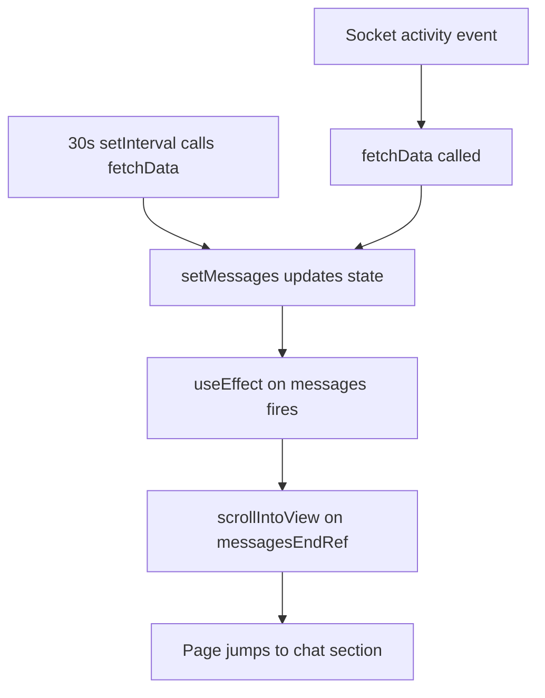
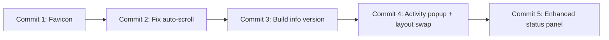

# UI Enhancements & Status Panel Plan

## Summary

Four changes to the Swissclaw Hub dashboard, each implemented as a separate commit with tests, lint, type-check, and visual validation before committing.

---

## Change 1: Activities Panel Redesign + Swap Activity/Chat Positions

### Problem
- Activity items are single-line and may contain long text with no way to read the full content.
- The current layout has Chat above the Kanban and Activity below it. The user wants Activity at the top and Chat at the bottom.
- The panel is called "Live Activity" but should be renamed to "Activities".
- With a growing history of activities, we need a way to manage large datasets without loading everything at once.

### Design

**Rename:** "⚡ Live Activity" → "⚡ Activities"

**Layout change:** In [`App.tsx`](client/src/App.tsx), the `top-panels` section currently contains Status + Chat side-by-side. Below the Kanban is the Activity panel. The new layout:

```
┌──────────────────────────────────────────────┐
│  Status Panel  │  Activities Panel            │  ← top-panels
├──────────────────────────────────────────────┤
│  Kanban Board                                 │
├──────────────────────────────────────────────┤
│  Chat Panel - full width, with input          │  ← bottom
└──────────────────────────────────────────────┘
```

**Activity detail popup:** Each activity item becomes clickable. Clicking opens a modal/popup showing:
- Full description text
- Activity type badge
- Timestamp
- Metadata (formatted JSON if present)

**Infinite scroll / pagination:** The Activities panel initially loads the most recent 20 activities. When the user scrolls to the bottom of the panel, it fetches the next batch of 20 older activities using cursor-based pagination. This requires:
- A new `GET /api/activities` endpoint with `limit` and `before` (cursor) query params
- The client tracks the oldest activity ID/timestamp as the cursor
- An `IntersectionObserver` on a sentinel element at the bottom of the activity list triggers the next fetch
- A "loading more..." indicator while fetching

**API design for pagination:**
```
GET /api/activities?limit=20                    → first page
GET /api/activities?limit=20&before=<timestamp> → next page
```

Response: `{ activities: Activity[], hasMore: boolean }`

### Files to Change

| File | Change |
|------|--------|
| [`server/index.ts`](server/index.ts) | Add `GET /api/activities` endpoint with `limit` and `before` query params. Returns paginated activities with `hasMore` flag. Add Swagger annotations. |
| [`server/config/swagger.ts`](server/config/swagger.ts) | Add schema for paginated activities response. |
| [`server/mcp-server.ts`](server/mcp-server.ts) | Add `get_activities` tool with optional `limit` and `before` params. |
| [`client/src/App.tsx`](client/src/App.tsx) | Rename panel to "Activities". Move Activity panel into `top-panels` grid replacing Chat, move Chat panel below Kanban. Add `ActivityDetailModal` component. Implement infinite scroll with IntersectionObserver. Add `fetchActivities` function with cursor-based pagination. |
| [`client/src/App.css`](client/src/App.css) | Update `.top-panels` grid to accommodate Status + Activities. Add `.chat-panel` standalone styles for below-kanban position. Add `.activity-detail-modal` styles. Add `cursor: pointer` and hover effect on `.activity-item`. Add `.activity-loading-more` styles. |
| [`client/src/__tests__/App.test.js`](client/src/__tests__/App.test.js) | Update tests: verify "Activities" heading, activity items in top section, chat below kanban. Add test for clicking an activity item to open the detail modal. Add test for closing the modal. |
| [`tests/integration/activities.test.js`](tests/integration/activities.test.js) | Add tests for `GET /api/activities` with pagination params. |
| [`docs/mcp-server.md`](docs/mcp-server.md) | Document `get_activities` tool. |
| [`README.md`](README.md) | Update MCP tools table to include `get_activities`. |

### Acceptance Criteria
- Panel renamed from "Live Activity" to "Activities"
- Activities panel is in the top-panels grid next to Status
- Chat panel is below the Kanban board (full width)
- Initially loads 20 most recent activities
- Scrolling to bottom of activities panel loads next 20 older activities
- Clicking an activity item opens a detail popup with full description, type, time, and metadata
- Clicking outside or pressing × closes the popup
- New `GET /api/activities` endpoint supports pagination
- New `get_activities` MCP tool works
- All existing tests pass (updated as needed)
- `npm run lint`, `npm run type-check`, `npm run test:client` all pass
- Visual validation on `npm run dev`

---

## Change 2: Fix Window Auto-Scroll Issue

### Problem
The page scrolls on its own approximately every 30 seconds. This is caused by the 30-second polling interval in [`App.tsx`](client/src/App.tsx:83-87) which calls `fetchData()`. When new messages arrive, the `useEffect` on line [105-107](client/src/App.tsx:105) triggers `scrollIntoView` on the messages container, causing the entire page to jump.

Additionally, the `activity` socket event handler on line [51](client/src/App.tsx:51) calls `fetchData()` on every activity, which also triggers the scroll.

### Root Cause Analysis



### Design

1. **Remove auto-scroll on data refresh:** The `scrollIntoView` should only trigger when the user sends a new message, not on every data fetch. Track whether the scroll was triggered by a user action vs. a background refresh.
2. **Conditional scroll:** Add a `shouldAutoScroll` ref that is set to `true` only when the user sends a message, and reset after scrolling.
3. **Remove fetchData from activity handler:** The activity socket handler on line 51 calls `fetchData()` which re-fetches everything including messages. This is unnecessary — the activity is already being added to state. Remove the `fetchData()` call from the activity handler.

### Files to Change

| File | Change |
|------|--------|
| [`client/src/App.tsx`](client/src/App.tsx) | Add `shouldAutoScroll` ref. Only call `scrollIntoView` when `shouldAutoScroll.current` is true. Set it to true in `sendMessage`, reset after scroll. Remove `fetchData()` from the activity socket handler. |
| [`client/src/__tests__/App.test.js`](client/src/__tests__/App.test.js) | Add test verifying `scrollIntoView` is NOT called on interval fetch. Add test verifying it IS called after sending a message. |

### Acceptance Criteria
- Page does not auto-scroll when the 30s poll fires
- Page does not auto-scroll when a socket activity event arrives
- Chat auto-scrolls to bottom only when the user sends a new message
- All tests pass
- `npm run lint`, `npm run type-check`, `npm run test:client` all pass
- Visual validation: leave page open for 2+ minutes, confirm no scroll jumps

---

## Change 3: Enhanced Status Panel with Icons, Activity Counter, and Model Usage

### Problem
The status panel is basic — just a dot, state text, current task, and last-updated time. It needs:
- Crab-themed icons for busy/sleeping/active states
- A counter or list of current activities
- Model usage and costs since midnight

### Design

**Status panel layout:**

```
┌─────────────────────────────────┐
│ 📡 Status                       │
├─────────────────────────────────┤
│  🦀💤  sleeping                 │  ← Crab icon varies by state
│  Current: Ready to help         │
│                                 │
│  ⚡ Activities: 12 today        │  ← Activity counter
│                                 │
│  🤖 Model Usage (since 00:00)  │
│  ├─ Tokens: 45,230 in / 12,100 out
│  ├─ Cost: $0.42                 │
│  └─ Updated: 07:32:15          │
└─────────────────────────────────┘
```

**Crab state icons** (using emoji combinations):
- `active` → 🦀⚡ (crab with lightning — working)
- `busy` → 🦀🔨 (crab with hammer — building)  
- `idle`/`sleeping` → 🦀💤 (crab sleeping)

**Backend changes:** The `/api/status` endpoint needs to return additional data:
- `activityCount`: number of activities since midnight (UTC)
- `modelUsage`: `{ inputTokens, outputTokens, estimatedCost, since }` — since midnight

This requires a new database query for activity count and a dedicated table for model usage tracking. We'll add a new `model_usage` table via a Sequelize migration, a new API endpoint `POST /api/service/model-usage` that the AI agent can call to report usage, and aggregate the data in the status query.

**Approach for model usage:** Create a dedicated `model_usage` table with a Sequelize migration. Each row stores one usage report with input/output tokens, model name, estimated cost, and timestamp. The `GET /api/status` endpoint aggregates rows since midnight UTC. The MCP server gets a new `report_model_usage` tool.

### Database Schema: `model_usage` table

| Column | Type | Notes |
|--------|------|-------|
| `id` | `INTEGER` | Primary key, auto-increment |
| `input_tokens` | `INTEGER` | Number of input tokens |
| `output_tokens` | `INTEGER` | Number of output tokens |
| `model` | `VARCHAR(100)` | Model name, e.g. claude-sonnet-4-20250514 |
| `estimated_cost` | `DECIMAL(10,6)` | Estimated cost in USD |
| `created_at` | `TIMESTAMP` | Defaults to CURRENT_TIMESTAMP |

### Files to Change

| File | Change |
|------|--------|
| [`database/migrations/20260215000000-create-model-usage.js`](database/migrations/20260215000000-create-model-usage.js) | **NEW:** Create migration for `model_usage` table. |
| [`server/index.ts`](server/index.ts) | Update `GET /api/status` to include `activityCount` (count of activities since midnight UTC) and `modelUsage` (aggregated from `model_usage` table since midnight). Add `POST /api/service/model-usage` endpoint. Update Swagger annotations. Update `resetTestDb` to truncate `model_usage` table. |
| [`server/config/swagger.ts`](server/config/swagger.ts) | Add `ModelUsage` and `ModelUsageReport` schemas. Update `StatusResponse` schema to include new fields. |
| [`server/mcp-server.ts`](server/mcp-server.ts) | Add `report_model_usage` tool. Update `get_status` tool description to mention new fields. |
| [`server/types/index.ts`](server/types/index.ts) | Add `ModelUsageData` and `ModelUsageRow` interfaces. |
| [`client/src/types/index.ts`](client/src/types/index.ts) | Update `StatusResponse` to include `activityCount` and `modelUsage` fields. |
| [`client/src/App.tsx`](client/src/App.tsx) | Redesign status panel: add crab state icons, activity counter, model usage display. |
| [`client/src/App.css`](client/src/App.css) | Add styles for new status panel elements: `.status-icon`, `.status-activity-count`, `.status-model-usage`. |
| [`client/src/__tests__/App.test.js`](client/src/__tests__/App.test.js) | Update mock status data to include new fields. Add tests for crab icons, activity counter, model usage display. |
| [`tests/integration/status.test.js`](tests/integration/status.test.js) | Add tests for `activityCount` and `modelUsage` in status response. Add test for `POST /api/service/model-usage`. |
| [`docs/mcp-server.md`](docs/mcp-server.md) | Document `report_model_usage` tool. Update `get_status` description. |
| [`docs/requirements-architecture.md`](docs/requirements-architecture.md) | Add `model_usage` table to the data model section. |
| [`README.md`](README.md) | Update MCP tools table to include `report_model_usage`. |

### API Changes

**`GET /api/status` — updated response:**
```json
{
  "status": "online",
  "swissclaw": {
    "state": "active",
    "currentTask": "Building Swissclaw Hub",
    "lastActive": "2026-02-15T07:32:15Z"
  },
  "activityCount": 12,
  "modelUsage": {
    "total": {
      "inputTokens": 45230,
      "outputTokens": 12100,
      "estimatedCost": 0.42
    },
    "byModel": [
      { "model": "claude-3-5-sonnet", "inputTokens": 25000, "outputTokens": 8000, "estimatedCost": 0.25 },
      { "model": "gpt-4", "inputTokens": 20230, "outputTokens": 4100, "estimatedCost": 0.17 }
    ],
    "since": "2026-02-15T00:00:00Z"
  },
  "recentMessages": [...],
  "recentActivities": [...]
}
```

**`POST /api/service/model-usage` — new endpoint:**
```json
// Request
{
  "inputTokens": 1500,
  "outputTokens": 400,
  "model": "claude-sonnet-4-20250514",
  "estimatedCost": 0.02
}
// Response: Activity record
```

**MCP `report_model_usage` tool:**
- Parameters: `inputTokens` (number), `outputTokens` (number), `model` (string), `estimatedCost` (number)
- Calls `POST /api/service/model-usage`

### Acceptance Criteria
- Status panel shows crab-themed emoji icons based on state
- Activity counter shows count of activities since midnight
- Model usage section shows tokens and estimated cost since midnight
- New `POST /api/service/model-usage` endpoint works
- New `report_model_usage` MCP tool works
- Swagger docs updated
- MCP docs updated
- README updated
- All tests pass: `npm run lint`, `npm run type-check`, `npm test`, `npm run test:client`
- Visual validation on `npm run dev`

---

## Change 4: Build Info Version Correction

### Problem
The version number is hardcoded as `'2.1.0'` in multiple places:
- [`server/index.ts`](server/index.ts:1213) - `getBuildInfo()` returns hardcoded version
- [`server/config/swagger.ts`](server/config/swagger.ts:8) - API spec version
- [`client/src/App.tsx`](client/src/App.tsx:27) - Initial BuildInfo state
- [`package.json`](package.json:5) - Package version

This requires manual updates and doesn't reflect the actual build time or deployment.

### Design
Replace the semantic version with a build timestamp approach:
- Remove hardcoded `'2.1.0'` from all locations
- Use build date (ISO 8601 format) as the version identifier
- Keep commit hash alongside build date
- Display format: `Built: 2026-02-15T06:53:46Z (abc1234)`

**Why this approach:**
- No manual version bumping needed
- Immediately tells when the build was deployed
- Commit hash still identifies the exact code state
- Works well with continuous deployment

### Files to Change

| File | Change |
|------|--------|
| [`server/index.ts`](server/index.ts) | Change `getBuildInfo()` to return `buildDate` (ISO timestamp) instead of hardcoded `version`. Update `BuildInfo` interface usage. |
| [`server/config/swagger.ts`](server/config/swagger.ts) | Update OpenAPI `version` to use dynamic build date or remove version field. Update `BuildInfo` schema to replace `version` with `buildDate`. |
| [`server/types/index.ts`](server/types/index.ts) | Update `BuildInfo` interface: replace `version: string` with `buildDate: string`. |
| [`client/src/types/index.ts`](client/src/types/index.ts) | Update `BuildInfo` interface: replace `version: string` with `buildDate: string`. |
| [`client/src/App.tsx`](client/src/App.tsx) | Update initial state to use `buildDate` instead of `version`. Update footer display to show build date. |
| [`client/src/App.css`](client/src/App.css) | Adjust footer styles if needed for longer build date string. |
| [`client/src/__tests__/App.test.js`](client/src/__tests__/App.test.js) | Update tests to check for `buildDate` instead of `version`. |
| [`package.json`](package.json) | Change version to `"0.0.0"` or `"0.0.0-development"` to indicate it's not used. |

### API Changes

**`GET /api/build` response change:**
```json
// Before
{
  "version": "2.1.0",
  "commit": "abc1234",
  "buildTime": "2026-02-15T06:53:46.312Z"
}

// After
{
  "buildDate": "2026-02-15T06:53:46Z",
  "commit": "abc1234"
}
```

### Acceptance Criteria
- No hardcoded `'2.1.0'` version remains in codebase
- Footer displays build date and commit hash
- `GET /api/build` returns `buildDate` instead of `version`
- Swagger docs updated to reflect new schema
- All TypeScript interfaces updated
- All tests pass: `npm run lint`, `npm run type-check`, `npm test`, `npm run test:client`
- Visual validation on `npm run dev` shows build date in footer

---

## Change 5: Browser Favicon

### Problem
No favicon is set — the browser shows a generic icon.

### Design
Add a crab emoji favicon using an SVG favicon (works in all modern browsers, no image file needed):

```html
<link rel="icon" href="data:image/svg+xml,<svg xmlns='http://www.w3.org/2000/svg' viewBox='0 0 100 100'><text y='.9em' font-size='90'>🦀</text></svg>">
```

This is the simplest approach — no image files to manage, and it matches the Swissclaw crab theme perfectly.

### Files to Change

| File | Change |
|------|--------|
| [`client/public/index.html`](client/public/index.html) | Add SVG favicon `<link>` tag in `<head>`. |
| [`client/src/__tests__/App.test.js`](client/src/__tests__/App.test.js) | No change needed (favicon is in HTML, not React). |

### Acceptance Criteria
- Browser tab shows a crab emoji icon
- Works in Chrome, Firefox, Edge
- `npm run lint`, `npm run type-check`, `npm run test:client` all pass
- Visual validation on `npm run dev`

---

## Implementation Order & Commit Strategy

Each change is a separate commit. Before each commit:
1. ✅ `npm run lint`
2. ✅ `npm run type-check`  
3. ✅ `npm test` (backend tests)
4. ✅ `npm run test:client` (frontend tests)
5. ✅ Visual validation on `npm run dev` (human check)
6. ✅ Verify API docs, MCP definitions, and markdown docs all align

### Commit sequence:



**Rationale for order:**
1. **Favicon first** — smallest, zero-risk change, quick win
2. **Auto-scroll fix** — independent bug fix, no UI restructuring
3. **Build info version** — updates the version display across frontend and backend, should be done before other UI changes
4. **Activities redesign + layout swap** — UI restructuring, rename, pagination, detail popup. Includes new `GET /api/activities` endpoint and `get_activities` MCP tool.
5. **Status panel enhancement** — largest change (backend + frontend + MCP + docs + migration), builds on the new layout from commit 4

---

## Documentation Alignment Checklist

For each commit that changes APIs or MCP tools:

| Document | Needs Update? | Which Commits? |
|----------|--------------|----------------|
| [`server/config/swagger.ts`](server/config/swagger.ts) | Yes | Commits 3, 4, 5 |
| [`server/index.ts`](server/index.ts) (Swagger annotations) | Yes | Commits 3, 4, 5 |
| [`server/mcp-server.ts`](server/mcp-server.ts) | Yes | Commits 4, 5 |
| [`docs/mcp-server.md`](docs/mcp-server.md) | Yes | Commits 4, 5 |
| [`README.md`](README.md) | Yes | Commits 4, 5 |
| [`docs/requirements.md`](docs/requirements.md) | No | — |
| [`docs/requirements-architecture.md`](docs/requirements-architecture.md) | Yes | Commit 5 (model_usage table) |
| [`docs/project-info.md`](docs/project-info.md) | Yes | Commit 3 (version info) |
